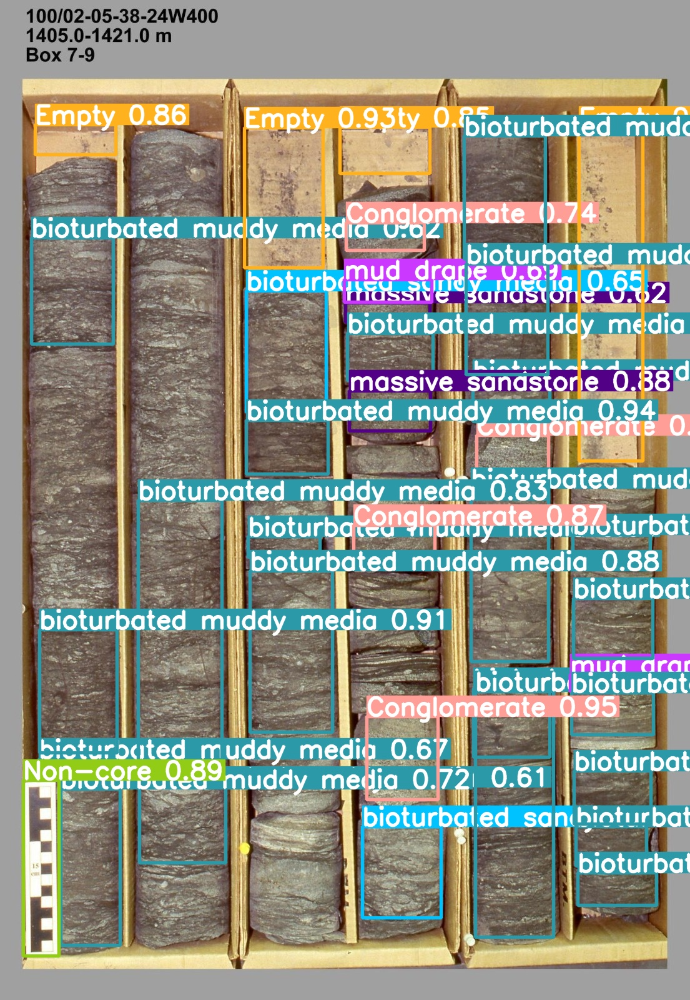

# Project Overview
This project is part of the Smart India Hackathon 2023. The goal of the project is to develop an intelligent system for detecting and classifying various objects in real-time using machine learning and computer vision techniques.

## Project Structure
```
Lithology/
├── backend/
│   └── utils/
│       ├── sendJWTToken.js    - JWT token generation and cookie management
│       └── executePython.js   - Python script execution utility
├── test/
│   └── react-proxy-example/
│       ├── api/               - Primary API server (port 3080)
│       ├── api2/              - Secondary API server (port 3070)
│       └── my-app/           - React frontend application
└── waste/                    - Development testing files
```

## Sample Detection Output

The following images are sample outputs from the `runs/detect` directory, showcasing the detection and classification capabilities of the system:

### Sample Detection Output

<table>
   <tr>
      <td style="text-align: center;">
         
         <p><em>Description: Detection results from the first prediction set.</em></p>
      </td>
      <td style="text-align: center;">
         
         <p><em>Description: Detection results from the second prediction set.</em></p>
      </td>
      <td style="text-align: center;">
         
         <p><em>Description: Detection results from the third prediction set.</em></p>
      </td>
   </tr>
</table>

These examples demonstrate the accuracy and efficiency of the detection system in various scenarios.

## Features
- JWT-based authentication
- Python script execution from Node.js
- React frontend with user management
- Dual API server setup with proxy configuration
- Bootstrap-based UI components

## Prerequisites
- Node.js (v14 or higher)
- Python (v3.x)
- npm or yarn

## Setup Instructions

1. **Install Dependencies**
   ```bash
   # Install backend dependencies
   cd backend
   npm install

   # Install frontend dependencies
   cd test/react-proxy-example/my-app
   npm install

   # Install API server dependencies
   cd ../api
   npm install
   cd ../api2
   npm install
   ```

2. **Environment Configuration**
   Create a `.env` file in the backend directory with:
   ```
   COOKIE_EXPIRE=7
   JWT_SECRET=your_secret_key
   NODE_ENV=development
   ```

3. **Running the Application**
   ```bash
   # Start the main API server (Port 3080)
   cd test/react-proxy-example/api
   npm start

   # Start the secondary API server (Port 3070)
   cd ../api2
   npm start

   # Start the React frontend
   cd ../my-app
   npm start
   ```

## API Endpoints

### Main API (Port 3080)
- GET `/api/users` - Fetch all users
- POST `/api/user` - Create new user

### Secondary API (Port 3070)
- GET `/api2/users` - Fetch users from secondary API
- POST `/api2/user` - Create user in secondary API

## Security Features
- HTTP-only cookies for JWT
- Secure cookie options in production
- Error handling for API requests
- Input validation for user creation

## Development Notes
- The frontend uses Bootstrap for styling
- Service worker is configured for PWA capabilities
- Python script execution is handled via child_process
- JWT token management includes proper error handling

## Error Handling
- API endpoints include try-catch blocks
- Python script execution has detailed error logging
- JWT token generation includes error handling
- Frontend includes loading and error states

## Contributing
1. Fork the repository
2. Create your feature branch
3. Commit your changes
4. Push to the branch
5. Create a new Pull Request

## License
This project is licensed under the MIT License.

## Contact
For any questions or feedback, please contact [Thakurmanas168@gmail.com].

